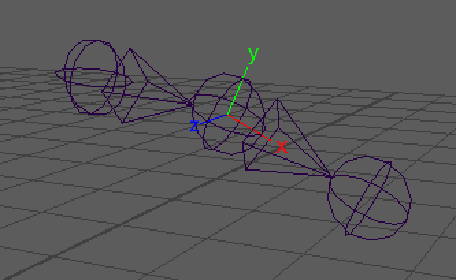
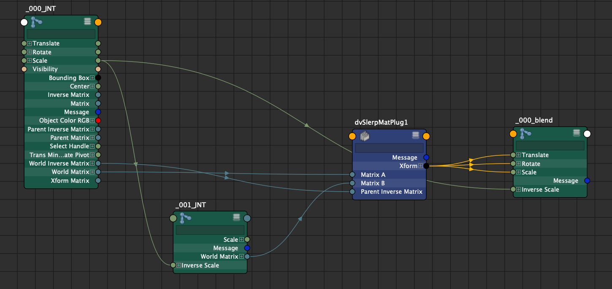
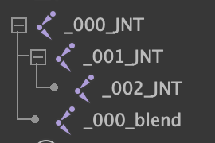

| Plug-ins | maya |
|:--------:|:--------:|
|Mode rig|True|

# dvSlerpMat


## Presentation
TODO

## Attributs

```bash
inputs: {
    rigMode
    matrixA
    matrixB
    parentInverseMatrix
}

storage: {
    offsetMatrix
}

outputs: {
    xform
        |-translate
        |    |-translateX  
        |    |-translateY  
        |    |-translateZ  
        |-rotate
        |    |-rotateX  
        |    |-rotateY  
        |    |-rotateZ  
        |-scale
        |    |-scaleX  
        |    |-scaleY  
        |    |-scaleZ

}
```
## Node editor Connection




## Commands (python)
